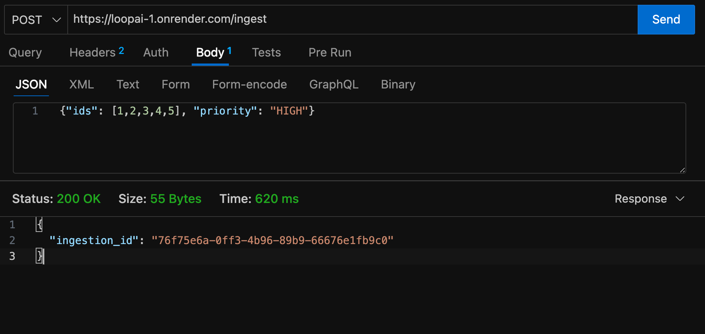
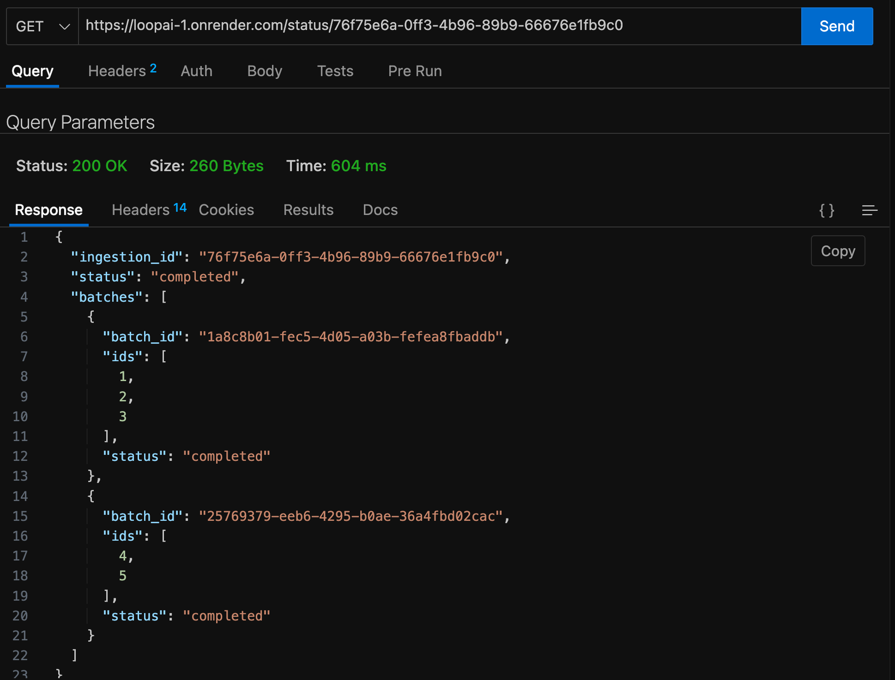

# Data Ingestion API System

## Overview

This project implements a RESTful API system for data ingestion and status tracking, with asynchronous batch processing, priority queueing, and rate limiting.

- **/ingest**: Submit a list of IDs and a priority. IDs are processed in batches of 3, with only one batch processed every 5 seconds.
- **/status/:ingestion_id**: Check the status of your ingestion request and its batches.

---

## Approach

- **Framework**: Node.js with Express for REST API endpoints.
- **Batching**: Each ingestion request is split into batches of 3 IDs.
- **Priority Queue**: Batches are queued and sorted by priority (`HIGH` > `MEDIUM` > `LOW`) and request time.
- **Rate Limiting**: Only one batch is processed every 5 seconds, regardless of queue length.
- **Async Processing**: Batch processing is handled in a background loop, simulating external API calls with a delay.
- **Status Tracking**: Each batch and ingestion request has a status (`yet_to_start`, `triggered`, `completed`).
- **In-Memory Storage**: All data is stored in memory for simplicity and fast prototyping.

---

## Setup Instructions

1. **Clone the repository**  
   ```
   git clone <your-repo-url>
   cd <your-repo-folder>
   ```

2. **Install dependencies**  
   ```
   npm install
   ```

3. **Run the server**  
   ```
   node app.js
   ```

4. **Run the tests**  
   ```
   npm test
   ```

---

## API Endpoints

### POST `/ingest`

- **Payload Example:**
  ```json
  {
    "ids": [1, 2, 3, 4, 5],
    "priority": "HIGH"
  }
  ```
- **Response Example:**
  ```json
  {
    "ingestion_id": "abc123"
  }
  ```

### GET `/status/:ingestion_id`

- **Response Example:**
  ```json
  {
    "ingestion_id": "abc123",
    "status": "triggered",
    "batches": [
      {"batch_id": "uuid1", "ids": [1, 2, 3], "status": "completed"},
      {"batch_id": "uuid2", "ids": [4, 5], "status": "completed"}
    ]
  }
  ```

---

---

## Screenshot of Test Run




---


